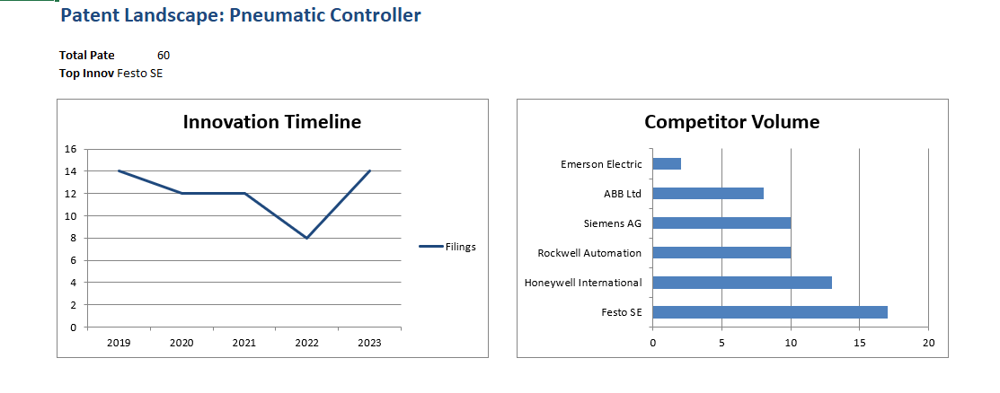
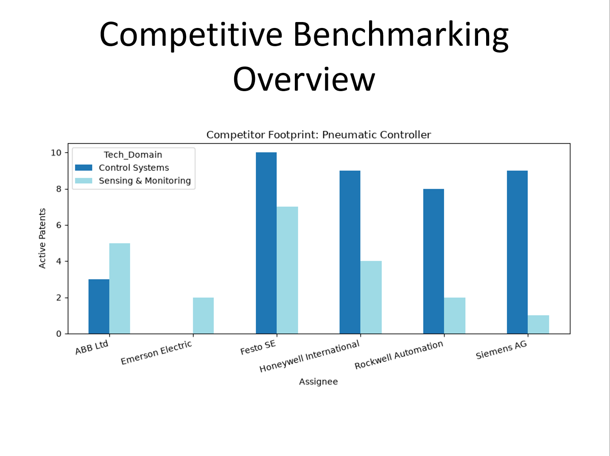

# USPTO Patent Strategy Automator 📊

An automated Python pipeline that pulls live patent data from the US Government (USPTO API) and generates Fortune-100 grade strategy reports. 

## 🚀 The Goal
To automate the manual IP lifecycle management process. This tool bypasses standard web scraping to pull 100% accurate, structured data from the official PatentsView REST API, calculating market gaps (White Spaces) and formatting the output into client-ready deliverables.

## 🛠️ Tech Stack
* **Python** (Core logic and API requests)
* **Pandas** (Data handling, aggregation, and cross-tabulation)
* **XlsxWriter** (Automated generation of native Excel charts and conditional formatting)
* **python-pptx** (Automated generation of presentation slide decks)

## 📂 Example Outputs

### Executive Excel Dashboard
*Features: Automated KPIs, interactive tables, and a conditionally formatted White Space Heatmap.*

### Automated Strategy Presentation
*Features: Auto-generated charting and data-driven insights highlighting specific market opportunities.*

## ⚙️ How to Run Locally
1. Clone this repository.
2. Install the requirements: `pip install -r requirements.txt`
3. Run the script: `python uspto_api_scout.py`
